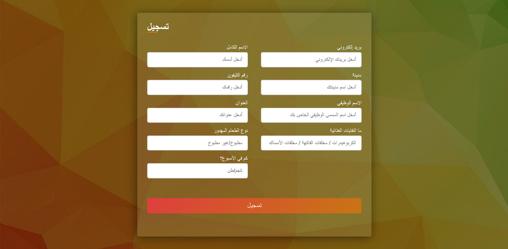

# ESCA
<<<<<<< HEAD

Student activity project which we participate with it in Enactus NC 2024

## Table of contents

- [Overview](#overview)
- [The project](#the-challenge)
- [Screenshot](#screenshot)
- [Links](#links)
- [Built with](#built-with)
- [Acknowledgments](#acknowledgments)

**Note: Delete this note and update the table of contents based on what sections you keep.**

## Overview

This website is dedicated to raising awareness about the critical issue of food waste and encouraging users to take action by providing food waste to us to explit it and recycling it in to valuable materials. It educates users on the environmental, economic, and social impacts of food waste and facilitates the donation process through a simple contact form. By learning about the problem and filling out the form, users can help reduce food waste by giving it to us.

### The project

Users should understand:

- The critical issue of food waste
- How can we solve this problem
- The impact of food waste on enviroment
- How can they donate the food for us so we can recycle it

### Screenshot

### Links

- Live Site URL: [Website](https://makhlouf7.github.io/ESCA/)

### Built with

- Semantic HTML5 markup
- CSS
- [jQuery](https://jquery.com/) - JS library
- [Bootstrap](https://getbootstrap.com/) - CSS framework

## Acknowledgments

- This project was developed by Enactus Assiut University IT-Committee.
- I'm glad that I contributed to this project.
=======
Student activity project which we participate with it in Enactus NC 2024. 
This project was developed by Enactus Assiut University IT-Committee. 
I'm glad that I contributed to this project.
>>>>>>> 895ec4492caa34b95527b3cce1a86b117477ceb4
